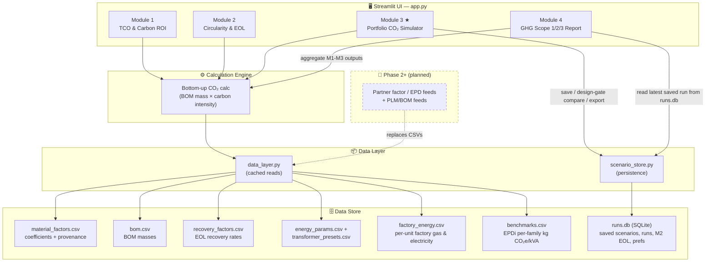
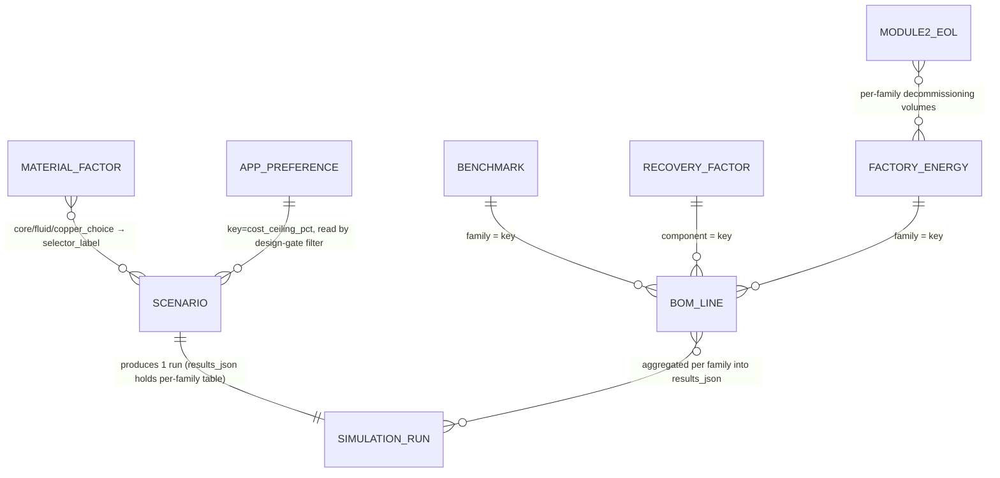

# Transformer Decarbonization Manager

**[▶ Live Demo](https://co2-calculator-prototype-transformer.streamlit.app/)**

A Streamlit prototype for evaluating and simulating CO₂ reduction across the transformer lifecycle — from embodied carbon in materials through to end-of-life recovery.

> 📌 See **[ROADMAP.md](ROADMAP.md)** for the full product vision, phased roadmap, and data-model evolution.

## Modules

| Module | Description |
|--------|-------------|
| **1. TCO & Carbon ROI** | Compares total cost of ownership and use-phase carbon (B1–B6) between standard and high-efficiency designs. Models loss energy from loading, discounts it to an NPV TCO, and derives lifetime CO₂ savings and payback. |
| **2. Circularity & EOL Planner** | End-of-life (C1–C4 + Module D). Quantifies the avoided-replacement carbon of a mid-life retrofill and the Module D recovery credit from structured decommissioning, using sourced per-material recovery rates. |
| **3. Portfolio CO₂ Simulator ★** | Bottom-up embodied carbon calculator (A1–A3 scope) — translates BOM material choices into fleet-wide CO₂ outcomes across product families and annual volumes. Engineers can compare a saved baseline with up to three alternatives in a design-gate view, with a transparent carbon-first recommendation, an optional **cost-ceiling constraint** to keep recommendations feasible for procurement, an **EPDi industry benchmark** column for context, cost trade-offs, uncertainty, and CSV export. |
| **4. GHG Scope 1/2/3 Report** | Aggregates Modules 1–3 into a corporate GHG-Protocol reporting view (Scope 1 factory fuel, Scope 2 factory electricity, Scope 3 Cat 1 / 11 / 12). Includes editable per-family factory-energy inputs (`data/factory_energy.csv`) and CSV export. Scope 1 & 2 use Phase 1 indicative estimates until Phase 2 metered factory data. |

## Competitive position

A 2026 landscape scan of five adjacent vendors (Makersite, sustamize, carbmee,
Sphera/GaBi, One Click LCA — see **[competitors/summarize-competitor.md](competitors/summarize-competitor.md)**)
found BOM-based A1–A3 PCF to be commoditized — all five ship it. None ship use-phase
loss economics, gate-ready kg CO₂e/kVA KPIs, per-lever €/t abatement ranking, or
quantified factor uncertainty. That quadrant — **electrical-equipment-specific ×
design-time decision support** — is the position this tool occupies. Strategy
consequence: partner for carbon/EPD data rather than rebuild it, and invest in the
decision layer competitors lack.

## Setup

```bash
pip install -r requirements.txt
streamlit run app.py
```

## Architecture

The app separates the **model** (calculation logic in `app.py`) from the **data**
(sourced coefficients, BOM masses, and saved runs). This is the key Phase 1
design decision — every later phase (live PLM/EPD feeds, optimisation, assurance)
plugs into the data layer without touching the UI or the calculation engine.



**Flow:** Module 3 reads carbon-intensity factors and BOM masses through
`data_layer.py`, runs the bottom-up calculation, then persists named scenarios and
their results through `scenario_store.py`. Module 2 reads the same BOM masses,
baseline factors, and per-material recovery rates to quantify end-of-life recovery
credits; Module 1 reads sourced energy assumptions and transformer presets to model
use-phase cost and carbon. Module 4 is an **aggregation/reporting layer**: it
re-buckets the latest Module 1–3 outputs (read from `runs.db`, the SQLite store)
into GHG-Protocol Scope 1/2/3 categories and adds new factory-energy inputs
(Scope 1 & 2) via `data/factory_energy.csv`. All go through the same
`data_layer.py` interface, so in Phase 2 the static CSVs are swapped for partner
factor/EPD data feeds behind it.

> An **Environmental Product Declaration (EPD)** is a standardized, independently
> verified report of a product's lifecycle environmental impacts, including embodied
> CO₂. In this tool a partner EPD data feed (e.g. machine-readable OpenEPD / ILCD)
> would replace the static CSV factor tables in Phase 2.

## Data model (Phase 1)

Reference data lives in sourced CSVs under `data/`; user-generated state lives in
`data/runs.db` (SQLite). `data_layer.py` and `scenario_store.py` expose both
through one interface — the seam Phase 2 partner feeds plug into without
touching `app.py`. Every factor carries provenance + `valid_from` / `valid_to`;
a freshness banner warns within 180 days of expiry.

| Entity | Where | Key | Notes |
|--------|-------|-----|-------|
| `MATERIAL_FACTOR` | `data/material_factors.csv` | `material_id` | per-material kg CO₂e/kg, uncertainty range, cost Δ, source, version, validity window |
| `BOM_LINE` | `data/bom.csv` | `(family, component)` | per-family BOM masses (core / copper / fluid / insulation / structural) |
| `RECOVERY_FACTOR` | `data/recovery_factors.csv` | `component` | EOL recovery rate, route, secondary-material note |
| `FACTORY_ENERGY` | `data/factory_energy.csv` | `family` | per-family gas + electricity per unit → Scope 1/2 |
| `BENCHMARK` | `data/benchmarks.csv` | `family` | EPDi industry average kg CO₂e/kVA, source ID, validity |
| `ENERGY_PARAMS` | `data/energy_params.csv` | `parameter` | key/value — grid intensity, energy price, hours, loading, discount rate, emission factors |
| `TRANSFORMER_PRESETS` | `data/transformer_presets.csv` | `(design, rating_kva)` | Standard vs. Eco-Efficient CAPEX and loss presets per rating |
| `SCENARIO` | `scenario` (SQLite) | `scenario_id` | name + 3 `MATERIAL_FACTOR.selector_label` choices (core/fluid/copper) + volume forecast |
| `SIMULATION_RUN` | `simulation_run` (SQLite) | `run_id` | `scenario_id` FK; portfolio totals + `results_json` (per-family table) |
| `MODULE2_EOL` | `module2_eol` (SQLite) | `eol_id` | Module 2 decommissioning output → consumed by Module 4 Scope 3.12 |
| `APP_PREFERENCE` | `app_preference` (SQLite) | `key` | generic k/v; today holds the design-gate cost-ceiling % |



SQLite has no FK constraints here — joins happen at read time in
`data_layer.py` / `scenario_store.py`. Only `SCENARIO → SIMULATION_RUN` is a real
DB-level FK (`scenario_id`). `BENCHMARK`, `RECOVERY_FACTOR` and `FACTORY_ENERGY`
stay as separate CSVs (not normalised into the BOM) so each has its own
provenance and validity window, and a Phase 2 partner-feed swap is a single
file. `MODULE2_EOL` lives in SQLite (not session state) so Module 4's report
survives tab refresh, multi-tab, and mobile views. `APP_PREFERENCE` is the
natural home for future user settings (regional grid factor, currency, etc.).

## Scope

- Module 3 covers **cradle-to-gate (A1–A3)** embodied emissions only — raw material extraction through factory gate.
- Use-phase energy losses (B1–B6) are addressed in Module 1.
- End-of-life (C1–C4) and recycling credits (Module D) are addressed in Module 2.
- Module 4 rebuckets Modules 1–3 outputs into **GHG Protocol Scope 1/2/3** for corporate reporting (CSRD/SBTi alignment). Scope 1 & 2 use indicative factory-energy estimates — full metered factory data is a Phase 2 deliverable.
- Full cradle-to-grave integration (A1–C4 + Module D) is planned for Phase 2.

See **[ROADMAP.md](ROADMAP.md)** for how these boundaries expand across future phases.

## Author 

- Raka Adrianto | Sustainability, Product, Data [LinkedIn](https://www.linkedin.com/in/lugasraka/)
