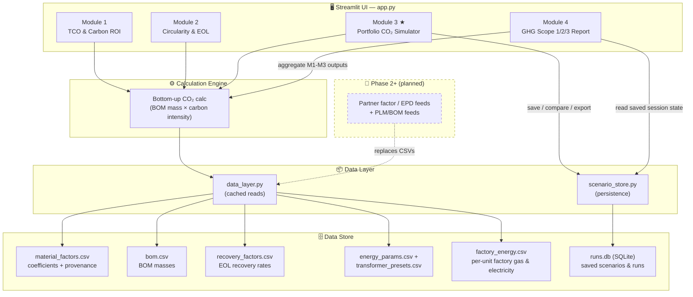
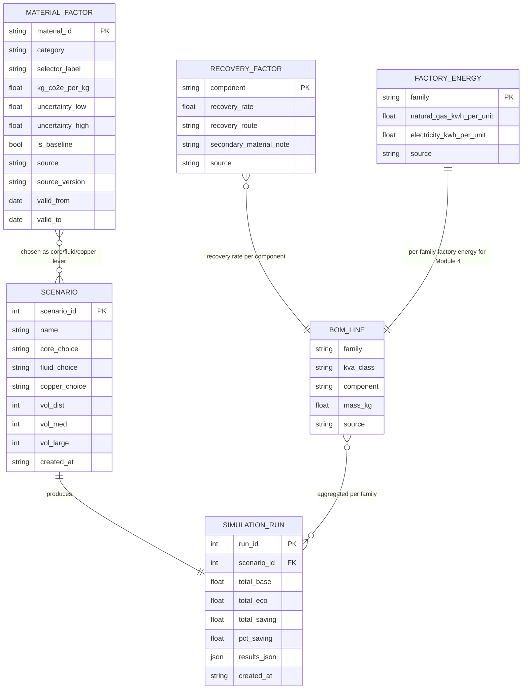

# Transformer Decarbonization Manager

**[▶ Live Demo](https://co2-calculator-prototype-transformer.streamlit.app/)**

A Streamlit prototype for evaluating and simulating CO₂ reduction across the transformer lifecycle — from embodied carbon in materials through to end-of-life recovery.

> 📌 See **[ROADMAP.md](ROADMAP.md)** for the full product vision, phased roadmap, and data-model evolution.

## Modules

| Module | Description |
|--------|-------------|
| **1. TCO & Carbon ROI** | Compares total cost of ownership and use-phase carbon (B1–B6) between standard and high-efficiency designs. Models loss energy from loading, discounts it to an NPV TCO, and derives lifetime CO₂ savings and payback. |
| **2. Circularity & EOL Planner** | End-of-life (C1–C4 + Module D). Quantifies the avoided-replacement carbon of a mid-life retrofill and the Module D recovery credit from structured decommissioning, using sourced per-material recovery rates. |
| **3. Portfolio CO₂ Simulator ★** | Bottom-up embodied carbon calculator (A1–A3 scope) — translates BOM material choices into fleet-wide CO₂ outcomes across product families and annual volumes. Outputs carry factor-uncertainty bounds, kg CO₂e/kVA gate KPIs, and per-lever abatement cost (€/t CO₂e). |
| **4. GHG Scope 1/2/3 Report** | Aggregates Modules 1–3 into a corporate GHG-Protocol reporting view (Scope 1 factory fuel, Scope 2 factory electricity, Scope 3 Cat 1 / 11 / 12). Includes editable per-family factory-energy inputs (`data/factory_energy.csv`) and CSV export. Scope 1 & 2 use Phase 1 indicative estimates until Phase 2 metered factory data. |

## Competitive position

A 2026 landscape scan of five adjacent vendors (Makersite, sustamize, carbmee,
Sphera/GaBi, One Click LCA — see **[competitors/summarize-competitor.md](competitors/summarize-competitor.md)**)
found BOM-based A1–A3 PCF to be commoditized — all five ship it. None ship use-phase
loss economics, gate-ready kg CO₂e/kVA KPIs, per-lever €/t abatement ranking, or
quantified factor uncertainty. That quadrant — **electrical-equipment-specific ×
design-time decision support** — is the position this tool occupies. Strategy
consequence: partner for carbon/EPD data rather than rebuild it, and invest in the
decision layer competitors lack.

## Setup

```bash
pip install -r requirements.txt
streamlit run app.py
```

## Architecture

The app separates the **model** (calculation logic in `app.py`) from the **data**
(sourced coefficients, BOM masses, and saved runs). This is the key Phase 1
design decision — every later phase (live PLM/EPD feeds, optimisation, assurance)
plugs into the data layer without touching the UI or the calculation engine.



**Flow:** Module 3 reads carbon-intensity factors and BOM masses through
`data_layer.py`, runs the bottom-up calculation, then persists named scenarios and
their results through `scenario_store.py`. Module 2 reads the same BOM masses,
baseline factors, and per-material recovery rates to quantify end-of-life recovery
credits; Module 1 reads sourced energy assumptions and transformer presets to model
use-phase cost and carbon. Module 4 is an **aggregation/reporting layer**: it
re-buckets the latest Module 1–3 outputs (read from Streamlit session state) into
GHG-Protocol Scope 1/2/3 categories and adds new factory-energy inputs (Scope 1 & 2)
via `data/factory_energy.csv`. All go through the same `data_layer.py` interface, so
in Phase 2 the static CSVs are swapped for partner factor/EPD data feeds behind it.

> An **Environmental Product Declaration (EPD)** is a standardized, independently
> verified report of a product's lifecycle environmental impacts, including embodied
> CO₂. In this tool a partner EPD data feed (e.g. machine-readable OpenEPD / ILCD)
> would replace the static CSV factor tables in Phase 2.

## Data model (Phase 1)

Reference data is separated from the calculation logic. Carbon-intensity
coefficients and bill-of-material masses live in sourced, versioned CSVs under
`data/`, loaded through `data_layer.py` — replacing the previously hardcoded
Python dicts. Each factor carries an uncertainty range and provenance
(source + version + validity dates), the groundwork for the Phase 2 live
PLM/EPD data feeds.



- **`MATERIAL_FACTOR`**, **`BOM_LINE`** and **`RECOVERY_FACTOR`** are the sourced reference data (CSV, read-only in the app).
- **`SCENARIO`** and **`SIMULATION_RUN`** are user-generated and persisted in `runs.db` (SQLite).
- Each scenario's lever choices reference a `MATERIAL_FACTOR`; each run aggregates `BOM_LINE` masses into portfolio CO₂ totals. Module 2 combines `BOM_LINE` masses with `RECOVERY_FACTOR` rates and baseline `MATERIAL_FACTOR` intensities to compute Module D credits. Module 4 reads `FACTORY_ENERGY` to estimate Scope 1 & 2, and rebuckets the latest Module 1–3 outputs into Scope 3 categories.

| File | Purpose |
|------|---------|
| `data/material_factors.csv` | Per-material CO₂ intensity (kg CO₂e/kg), uncertainty range, cost delta vs. baseline (€/kg), supplier programme, source & version |
| `data/bom.csv` | Long-format bill-of-material masses per transformer class |
| `data/recovery_factors.csv` | Per-component end-of-life recovery rates & routes (Module 2 Module D credits) |
| `data/energy_params.csv` | Operating & evaluation assumptions for Module 1 (grid intensity, energy price, hours, loading, horizon, discount rate) |
| `data/transformer_presets.csv` | Standard vs. Eco-Efficient CAPEX and loss presets per rating (Module 1) |
| `data/factory_energy.csv` | Per-family factory gas & electricity per unit (Scope 1 & 2, Module 4) |
| `data_layer.py` | Cached access layer exposing factors, BOM, recovery rates, energy params and the reference table to the app |
| `scenario_store.py` | SQLite-backed persistence for named scenarios and simulation runs (`data/runs.db`) |

Module 3 lets you **save named scenarios**, **export** per-family results to CSV,
and **compare** saved runs side by side. Saved runs persist locally in
`data/runs.db` (gitignored, regenerated at runtime). Module 2 exports its
portfolio and per-component Module D credit tables to CSV.

## Scope

- Module 3 covers **cradle-to-gate (A1–A3)** embodied emissions only — raw material extraction through factory gate.
- Use-phase energy losses (B1–B6) are addressed in Module 1.
- End-of-life (C1–C4) and recycling credits (Module D) are addressed in Module 2.
- Module 4 rebuckets Modules 1–3 outputs into **GHG Protocol Scope 1/2/3** for corporate reporting (CSRD/SBTi alignment). Scope 1 & 2 use indicative factory-energy estimates — full metered factory data is a Phase 2 deliverable.
- Full cradle-to-grave integration (A1–C4 + Module D) is planned for Phase 2.

See **[ROADMAP.md](ROADMAP.md)** for how these boundaries expand across future phases.

## Author 

- Raka Adrianto | Sustainability, Product, Data [LinkedIn](https://www.linkedin.com/in/lugasraka/)